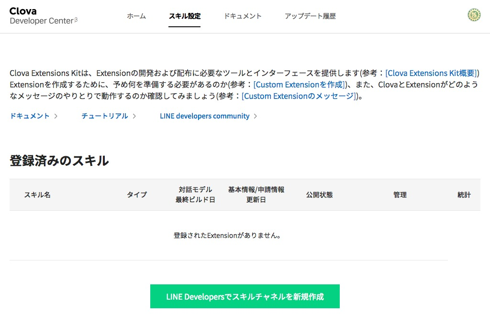

## Clovaスキルの作成

### Clova Developer Center β へのログイン 

https://clova-developers.line.biz/ にアクセスする

ログイン > LINEアカウントでログイン を選ぶ

LINEのメールアドレス、パスワードを入力して（もしくはQRコードで）ログインする

### スキルの作成

ログインすると、Clova Developer Center β のページに戻る。

画面中央の　**スキルを開発する** を選ぶ。

#### Clova Extensions KitでExtensionを作成

既存のスキルの一覧が表示される（初回の場合は、一覧には何もない）。

**LINE Developersでスキルチャネルを新規作成** のボタンを選択する。

#### 新規チャネル作成

これまでに作成したプロパイダーが表示される（初回の場合は、 新規プロバイダー作成 だけが表示される）。

LINE Botなどを作成したことがある場合は同じチャンネルを選ぶ。 チャンネルが無い場合は新規プロパイダー作成を選んで新たにチャンネルを作成する。

完了したら、 **次のページ** をクリックする。

チャンネル名に `部屋の環境` といれる。

確認画面が出てくるので、 **作成してClova Developer Centerに移動** ボタンを押す。

### 利用規約の同意

- 提示された規約を承諾し、 **スキル開発をはじめる** ボタンを押す。

-----

[戻る](../../README.md)　| [基本情報へ](./02.md)