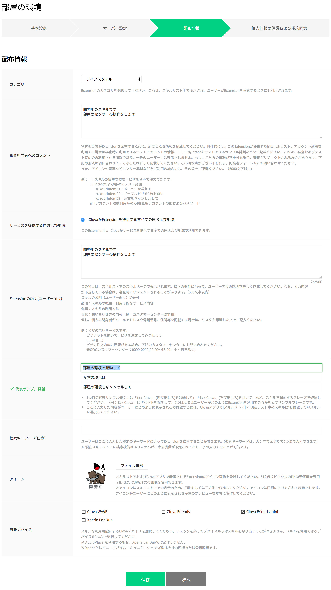

## Clovaスキルの作成

### Clova Developer Center β へのログイン 

https://clova-developers.line.biz/ にアクセスする

ログイン > LINEアカウントでログイン を選ぶ

LINEのメールアドレス、パスワードを入力してログインする

### スキルの作成

ログインすると、Clova Developer Center β のページに戻る。

画面中央の　**スキルを開発する** を選ぶ。

#### Clova Extensions KitでExtensionを作成

既存のスキルの一覧が表示される（初回の場合は、一覧には何もない）。

**LINE Developersでスキルチャネルを新規作成** のボタンを選択する。

#### 新規チャネル作成

これまでに作成したプロパイダーが表示される（初回の場合は、 新規プロバイダー作成 だけが表示される）。

LINE Botなどを作成したことがある場合は同じチャンネルを選ぶ。 チャンネルが無い場合は新規プロパイダー作成を選んで新たにチャンネルを作成する。

完了したら、 **次のページ** をクリックする。

チャンネル名に `部屋の環境` といれる。

確認画面が出てくるので、 **作成してClova Developer Centerに移動** ボタンを押す。

### 新しいExtensionを作成

#### 基本設定

基本設定 画面が表示されるので、それぞれ項目を入力する。

- タイプ　`カスタム`
- Extension ID `com.example.xxxxxx.room`
    - `xxxxxx` は学籍番号やユーザー名などの任意の文字列
- スキル名 `部屋の環境`
- 呼び出し方（メイン） `部屋の環境`
- 呼び出し方（サブ） へやのかんきょう へやかんきょう
- AudioPlayerの使用 `いいえ`
- 提供者について
    - 提供者区分 `個人`
    - 提供者名 `あなたの名前`
    - 担当者メールアドレス `あなたのメールアドレス`
    - Exceptionと連係するLINEアカウント `選択してください`（選択しない）
    - 利用規約に同意 にチェック
    - LINE User Developer Policy にチェック

**作成** ボタンを押す。

確認画面が出てくるので、 **次へ** ボタンを押す。

#### サーバ設定

サーバ設定画面が表示されるので、それぞれ項目を入力する。

- ExtensionサーバのURL `http://xxxxxx.ngrok.io/clova`
    - xxxxxx は、あなたのPCでngrokが生成した番号
- アカウント連係の有無　`いいえ`

入力が完了したら、 **次へ** ボタンを押す。

#### 配布情報

配布情報画面が表示されるので、それぞれ項目を入力する。

- カテゴリ　`ライフスタイル`
- 審査担当者へのコメント `開発用のスキルです　部屋のセンサーの操作をします`
- Exceptionの説明 `開発用のスキルです　部屋のセンサーの操作をします`
- 代表サンプル発話
    - `ねぇClova、部屋の環境を教えて`
    - `食堂の環境は`
    - `部屋の環境をキャンセルして`
- 検索キーワード `（なし）`
- アイコン
    - 512px × 512px の画像
    - 適切なものがなければ下の画像をサンプルにどうぞ。 
- 対象デバイス `Clova Friends mini`

入力が完了したら、 **次へ** ボタンを押す。

#### 個人情報の保護および規約同意

個人情報の保護および規約同意 画面が表示されるので、それぞれ項目を入力する。

- 購入/支払い機能はありますか？ `いいえ`
- 個人情報を取得しますか？ `いいえ`
- プライバシーポリシーのURL（任意）　`（空欄のまま）`
- 利用規約のURL（任意） `（空欄のまま）`

入力が完了したら、 **保存** ボタンを押す。

保存が完了したら、 **対話モデル** ボタンを押す。

-----

[戻る](../../README.md)　| [対話モデルの入力へ](./02.md)