## 対話モデルの作成

Clova Developer Center β のログイン後、もしくはスキルの作成ページから、対話モデル：ダッシュボードを起動する。

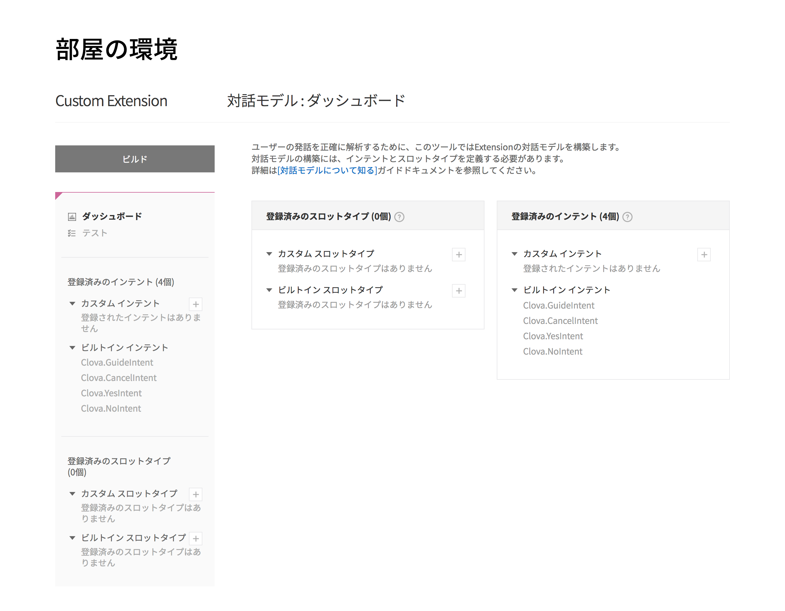

### スロットタイプの登録

**スロットタイプとは、Clovaが聞き分ける単語の種別** のこと。

Clovaは、

- <u>食堂</u> の環境を教えて
- <u>学生ホール</u> の環境を教えて

のように、同じ会話でも文章中のスロットタイプ（下線部分）の単語が異なることを区別できる。

#### カスタムスロットタイプ（単語の種別）の追加

対話モデル：ダッシュボードの中で、 **登録済みのスロットタイプ（n個）** の欄の、 **カスタムスロットタイプ** の **「＋」** ボタンを押す。

新しいスロットタイプのタイトル 画面が表示される。

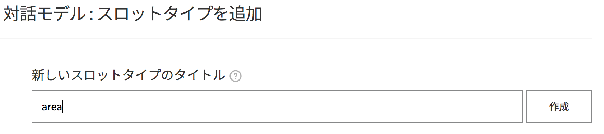

新しいスロットタイプのタイトルに `area` と入力し、 **作成** ボタンを押す。

#### スロットタイプの辞書の追加

対話モデル:スロットタイプを追加 画面が表示される。

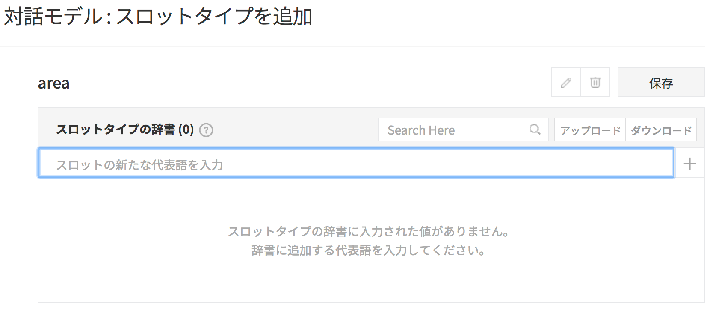

**スロットタイプの辞書（n個）** の欄の、 **スロットの新たな代表語を入力** の部分に `食堂` と入力し **「＋」** ボタンを押す。

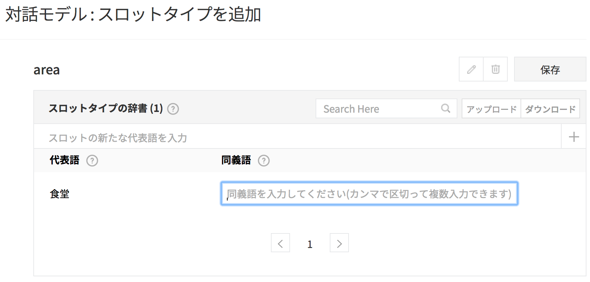

同義語欄に、 `食堂` のよみがなや、食堂と認識させる言葉をカンマ区切りで入力する。

たとえばここでは、 `しょくどう`, `しょくど`, `よくどう` としておく。

**保存** ボタンを押す。

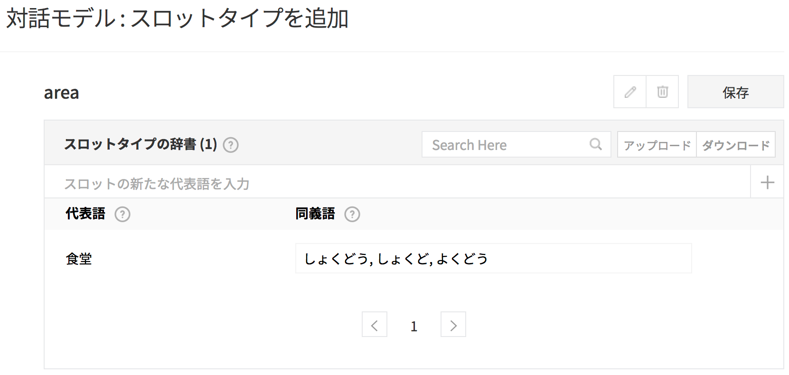

同じように、`学生ホール` もスロットタイプの辞書に保存する。

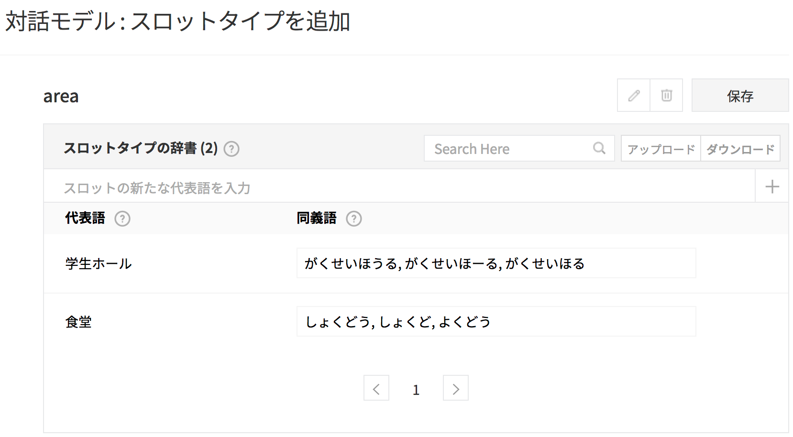

### インテント（定型文）の登録

**インテントとは、Clovaに話しかけられる定型文** のこと。

- **** <u>の環境を教えて</u>
- **** <u>のモーターを動かして</u>

のように、Clovaは定型文によって基本的な動作や処理を変える。

#### カスタムインテント（定型文の種別）の追加

**登録済みのインテント（n）** の欄の、 **カスタムインテント** の **「＋」** ボタンを押す。

対話モデル：インテントを追加 画面が表示される。

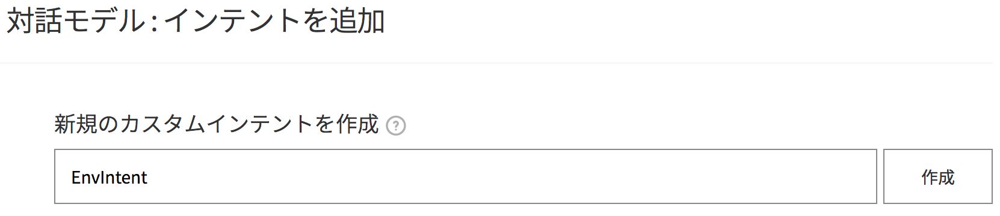

**新しく作成するインテントの名称...** に `EnvIntent` と入力し、 **作成** ボタンを押す。

すると、EnvIntent の設定画面が表示される。

#### スロットリストの登録

まず、下部の **スロットリスト(n)** 欄の **新規のスロットを追加しましょう** で、 `area` と入力する。

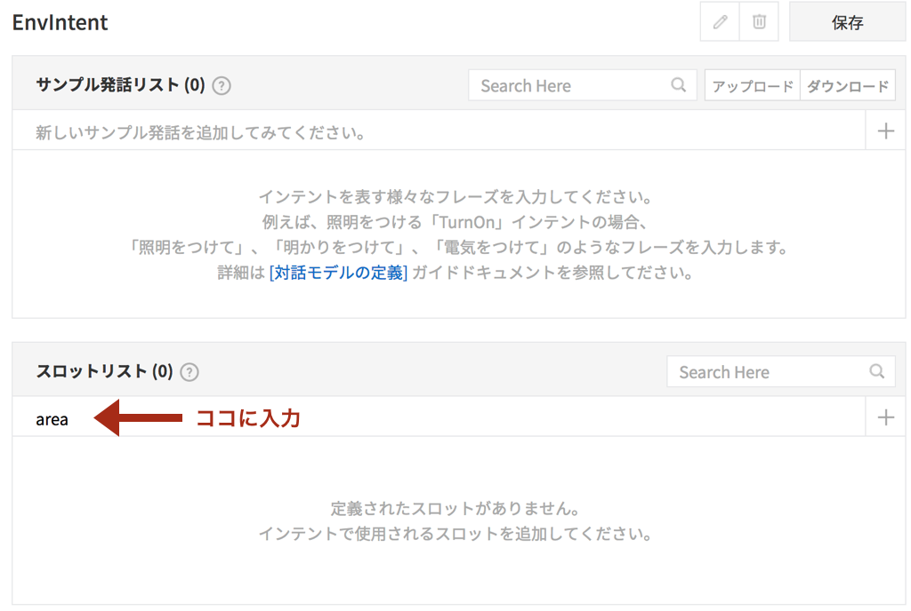

「+」ボタンを押すと、「スロットタイプを選択してください」と表示される。

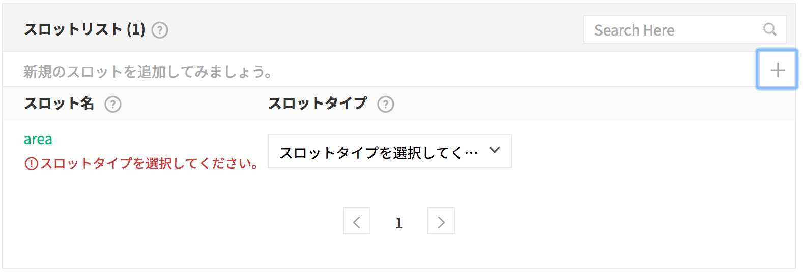

スロットタイプの選択肢から、先ほど作成した `area` を選ぶ。

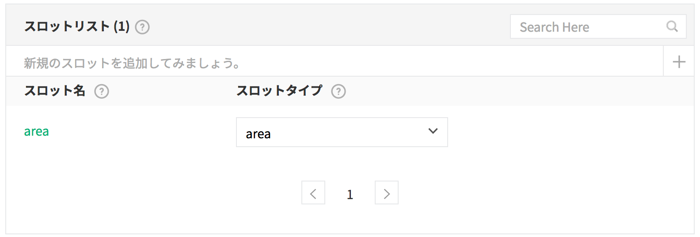

#### サンプル発話リストの登録

上部の **サンプル発話リスト (0)** 欄の **新しいサンプル発話を追加...** で、 `xxxxの環境を教えて` と入力する。

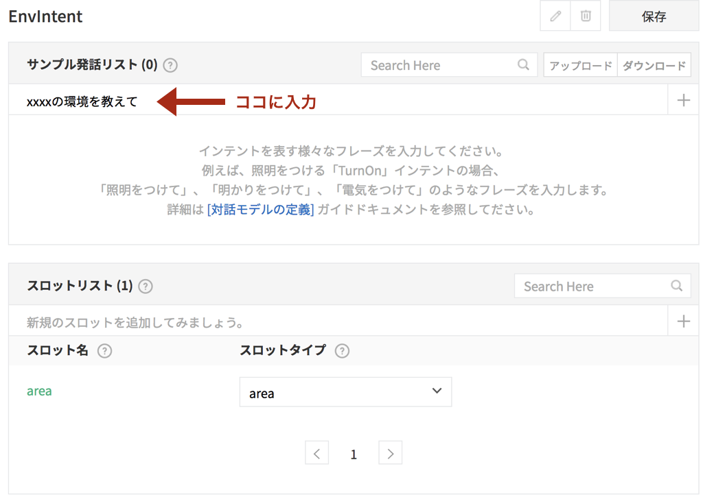

<u>「＋」ボタンを押すと、その文章が下の段に登録される</u>。

その上で、 `xxxxの環境を教えて` の xxxx を選択状態にすると、 **登録されたスロットを選択** という子ダイアログが表示される。 

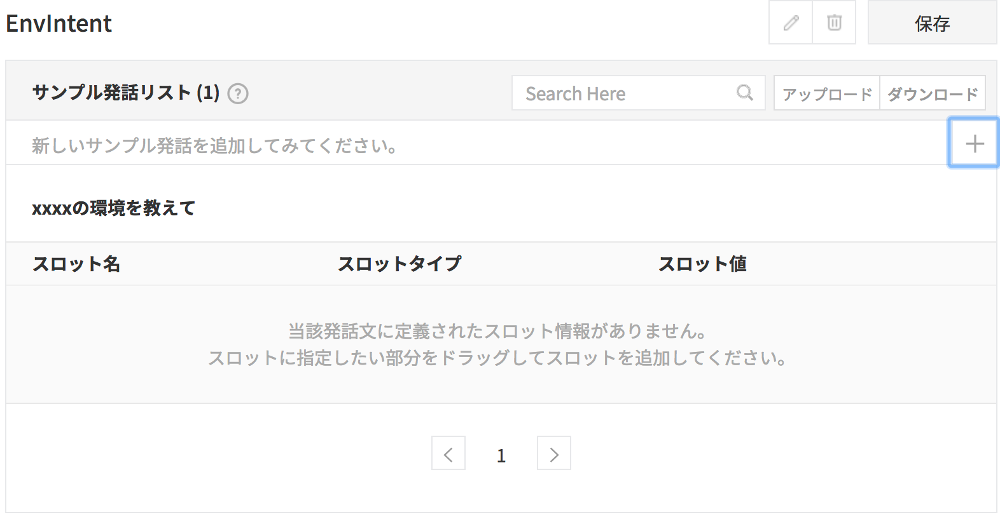

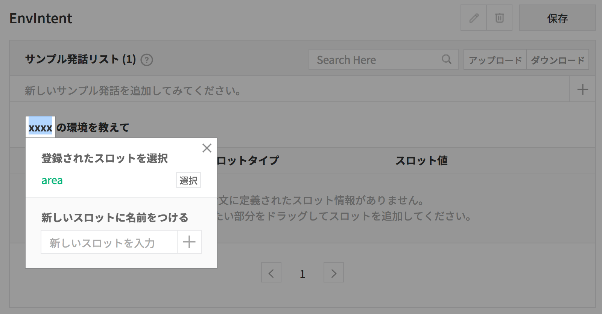

`area` の横の **選択** ボタンを押す。

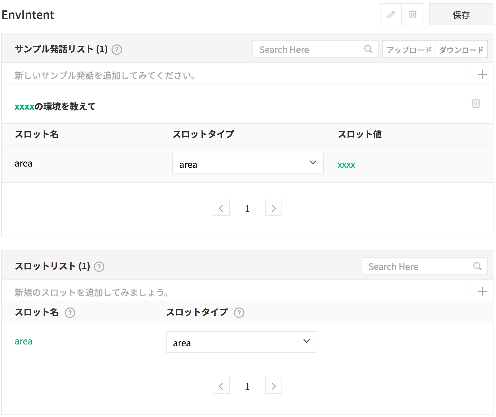

**保存**　ボタンを押す。

### ビルドとテスト

対話モデルを有効にするためには、登録内容の「ビルド」を行う必要がある。

#### ビルド

画面左側にある **ビルド** ボタンを押す。（数分程度の時間がかかる）

#### テスト

ビルドが完了したら、ちゃんと対話モデルが設定されているかテストする。

画面左側の **テスト** メニューを押す。

ユーザーのサンプル発話をテスト 欄に　`食堂の環境を教えて` と入力し、 **テスト** ボタンを押す。

テスト結果の以下の項目を確認する。

- 解析されたインテント `EnvIntent`
- 解析されたスロット
    - スロット名 `area`
    - 解析されたスロットデータ `食堂`

`学生ホールの環境を教えて` と入力すると、 `解析されたスロットデータ` が `学生ホール` に変わる。

### ここまでのまとめ

- スロットタイプでは、`area` に二つの単語「食堂」「学生ホール」を追加した。
- サンプル発話リストでは、`EnvIntent` を登録した。 これは `xxxxの環境を教えて` という定型文で、 `xxxx` に `area` を指定した。

これにより、Clovaは、`○○の環境を教えて` と話しかけられると、 `EnvIntent` についての会話だと認識できる。さらに、○○が `食堂` と `学生ホール` の場合を聞き分けることができるようになる。

-----

[戻る](../README.md)