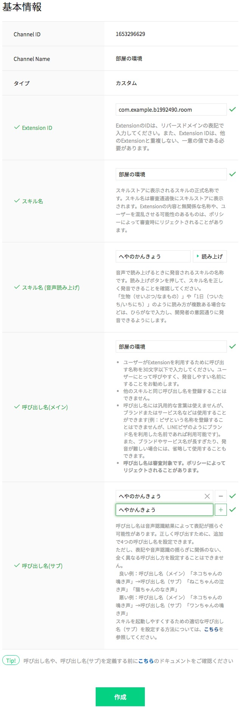

## Clovaスキルの作成

### 基本情報

基本設定 画面が表示されるので、それぞれ項目を入力する。

- Extension ID `com.example.xxxxxx.room`
    - `xxxxxx` は学籍番号やユーザー名などの任意の文字列
- スキル名 `部屋の環境`
- スキル名 (音声読み上げ) `へやのかんきょう`
- 呼び出し方（メイン） `部屋の環境`
- 呼び出し方（サブ） へやのかんきょう へやかんきょう
<!-- - AudioPlayerの使用 `いいえ`
- 提供者について
    - 提供者区分 `個人`
    - 提供者名 `あなたの名前`
    - 担当者メールアドレス `あなたのメールアドレス`
    - Exceptionと連係するLINEアカウント `選択してください`（選択しない）
    - 利用規約に同意 にチェック
    - LINE User Developer Policy にチェック
-->

**作成** ボタンを押す。

確認画面が出てくるので、 **次へ** ボタンを押す。

-----

[戻る](../../README.md)　| [対話モデルへ](./03.md)