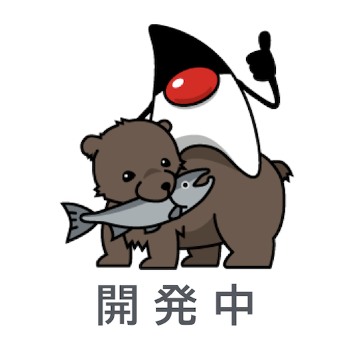

## Clovaスキルの作成

### 開発設定

#### サーバ設定

サーバ設定画面が表示されるので、項目を設定する。

- ExtensionサーバのURL `http://xxxx.jp.ngrok.io/clova`
    - xxxxxx は、あなたのPCでngrokが生成した番号
- AudioPlayer利用の有無 `いいえ`

入力が完了したら、 **次へ** ボタンを押す。

#### アカウント連携

アカウント連携画面が表示されるので、項目を設定する。

- アカウント連係の有無　`いいえ`

入力が完了したら、 **次へ** ボタンを押す。

### ユーザ設定

#### スキルストア

スキルストア画面が表示されるので、項目を設定する。

- カテゴリ　`ライフスタイル`
- スキルの説明(スキルストア表示) `開発用のスキルです　部屋のセンサーの操作をします`
- 代表サンプル発話
    - `ねぇClova、部屋の環境を起動して`
    - `食堂の環境は`
    - `部屋の環境をキャンセルして`
- 検索キーワード　設定不要
- アイコン
    - 512px × 512px の画像
    - 適切なものがなければ下の画像をサンプルにどうぞ。 
- 対象デバイス `Clova Friends mini`

入力が完了したら、 **次へ** ボタンを押す。

#### 個人情報の保護および規約同意

個人情報の保護および規約同意 画面が表示されるので、それぞれ項目を入力する。

- 購入/支払い機能はありますか？ `いいえ`
- 個人情報を取得しますか？ `いいえ`
- プライバシーポリシーのURL（任意）　設定不要
- 利用規約のURL（任意） 設定不要

入力が完了したら、 **次へ** ボタンを押す。

-----

[戻る](../../README.md)　| [テストへ](./04.md)
